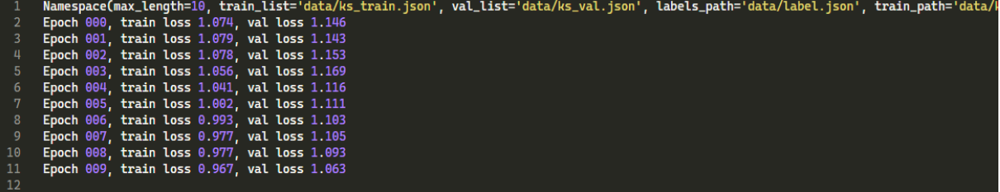

# [2024 EE738] 음성인식 시스템 Project

2024년도 1학기 EE738 음성인식 시스템 수업에서 진행한 프로젝트입니다.

프로젝트의 내용

1. 기본으로 주어진 음성인식시스템 (Speech Recognition)모델의 학습 및 평가를 진행
2. 주어진 모델의 문제점 파악 및 개선하여 디자인 및 학습
3. CER(Character Error Rate)를 measure로 개선 성능평가

## Baseline Result

$CER = 35.81$ (%)

## Method

Conformer Layer, Transformer Layer의 추가를 통한 디자인 변경

## Training

데이터 증강을 수행하기 위해 입력 음성에 2dB의 배경 소음을 추가하였습니다. 스케줄러로는 PyTorch의 LambdaLR 스케줄러를 사용하였으며, 이는 λ(epoch) = 0.95^epoch의 람다 표현식을 적용합니다.

첫 번째 사전 학습 단계에서는 학습률을 1e−4로 설정하고, 증강되지 않은 데이터셋을 사용하여 20 epoch 동안 모델을 학습시켰습니다.

두 번째 미세 조정 단계에서는 스케줄러를 적용하였으며, 학습 데이터에 0.3의 확률로 소음을 추가하였습니다. 해당 단계에서는 10 epoch 동안 모델을 미세 조정하였습니다.

## Result

$CER = 26.74$ (%)
